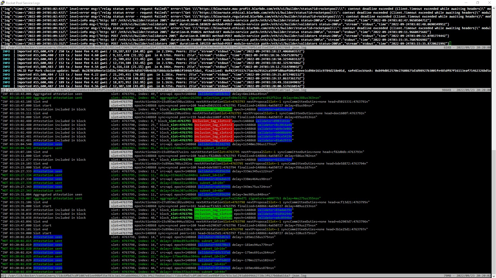

# multitail
This is a set of instructions on how to confiuge multitail to view the Rocket Pool logs in a clear and color-highlighted version. 

<br>

## Installation instructions


1. Install multitail: 
    ```
    sudo apt install multitail
    ```

1. Create a color scheme for the logs. Note this currently supports Nimbus and Besu. I invite others to add to this for the other clients
    ```
    sudo nano mutltitail.conf
    ```


1. Copy and paste the following script into `mutltitail.conf`. Press Ctrl-X to save and exit:

    ```
    titlebar:Rocket Pool Service Logs
    #             what to put in the titlebar of the xterm in which MultiTail is
    #             running. see below for details


    # use bright colors
    bright:1
    #
    # wether to abbreviate filesizes to xKB/MB/GB
    abbreviate_filesize:on
    #
    # show number of subwindow?
    show_subwindow_id:off
    #
    # attributes for the marker-line
    markerline_color:red,black,reverse
    #
    # show timestamp in markerline?
    markerline_timestamp:on
    # whot character to print in the markerline
    markerline_char:-

    # how many initial lines to tail at least initially (if available)
    min_n_bufferlines:2000


    #mevboost
    colorscheme:mevboost

    #besu
    colorscheme:besu
    cs_re:cyan:INFO
    cs_re:white,red:WARN.*
    cs_re:white,magenta:ERROR.*

    #Nimbus
    colorscheme:nimbus
    cs_re:white,magenta,blink:nextProposalSlot=[^-].([0-9]*)
    cs_re:magenta:Eth1 sync progress.*
    cs_re:magenta,yellow,underline:Missed.*
    cs_re:blue,magenta,bold:Syncing in progress.*
    cs_re:yellow:Slot=.([A-z0-9]*)
    cs_re:black,white: slot=.([A-z0-9]*)
    cs_re:green,,bold:slot=.([A-z0-9]*)
    cs_re:cyan:Sync committee message sent.*
    cs_re:cyan:Contribution sent.*
    cs_re:green,blue:Attestation seen
    cs_re:green,blue:validator=..([A-z0-9]*)
    cs_re:magenta:Received blocks from an unviable fork.*

    cs_re:white,red:inclusion_lag_slots=[^0*].([1-9]*)
    cs_re:black,green:inclusion_lag_slots=0
    cs_re:black,green:timely_source=true
    cs_re:black,green:timely_target=true
    cs_re:black,green:timely_head=true
    cs_re:black,red:timely_source=false
    cs_re:black,red:timely_target=false
    cs_re:black,red:timely_head=false

    cs_re:white,red:Attestation failed to match head
    cs_re:white,red:Attestation failed to match target
    cs_re:white,red:Previous epoch attestation missing
    cs_re:white:State replayed

    cs_re:blue:LC optimistic update sent.*
    cs_re:blue:LC finality update sent.*

    cs_re:white:INF.*
    cs_re:green,black:NOT.*
    cs_re:white,red:WRN.*
    ```


1. Create a script to lauch multitail
    ```
    sudo nano logs.sh
    ```

1. Copy and paste the following script into `logs.sh`. Press Ctrl-X to save and exit:

    ```
    #!/bin/bash

    # set -x #echo one

    # This is a simple script to color the output of the RP logs

    eth1=$(docker inspect --format="{{.Id}}" rocketpool_eth1)
    eth2=$(docker inspect --format="{{.Id}}" rocketpool_eth2)
    mevboost=$(docker inspect --format="{{.Id}}" rocketpool_mev-boost)

    echo FYI your log locations:
    echo eth1      /var/lib/docker/containers/$eth1/$eth1-json.log
    echo eth2      /var/lib/docker/containers/$eth2/$eth2-json.log
    echo mev-boost /var/lib/docker/containers/$mevboost/$mevboost-json.log

    sudo multitail -F ~/multitail.conf \
            -wh 10 -cS besu -p l -f -n 1000 \
                    -ke '(https:/.[A-z0-9]*@)' \
                    /var/lib/docker/containers/$mevboost/$mevboost-json.log \
            -wh 10 -cS besu -p l -f -n 1000 \
                    /var/lib/docker/containers/$eth1/$eth1-json.log \
            -cS nimbus -p l -f -n 1000 \
                    -kc ':' 0 \
                    -kc " " 1 \
                    -kr 1 2 \
                    -ke '(\+00:00)' \
                    -ke '\\' \
                    -ke '(\"\()' \
                    -ke '(aggregation_bits: .[A-z0-9]*,)' \
                    -ke 'topics=' \
                    -ke '(attestation=.[A-z0-9]*)' \
                    -ke '(attestation_data=)' \
                    -ke '(aggregate=.\"\()' \
                    -ke 'topics=' \
                    -ke '(attestation=.\s*)' \
                    -ke '(\"val_mon.\" )' \
                    -ke '(\"beacnde.\" )' \
                    -ke '(, data: \()' \
                    -ke ',"stream":"stdout",.*' \
                    -ke '( beacon_block_root: ....[A-z0-9"]*,)' \
                    -ke '( source: ....[A-z0-9:"]*,)' \
                    -ke '( target: ....[A-z0-9:"]*\),)' \
                    -ke '( target: ....[A-z0-9:"]*\))' \
                    -ke '( signature: ....[A-z0-9:"]*\))' \
                    -ev '(Attestation included in aggregate)' \
                    /var/lib/docker/containers/$eth2/$eth2-json.log
    ```

1. Make `logs.sh` executable.

    ```
    sudo chmod +x logs.sh
    ```

1. Enable the metrics in MEV-boost by adding the following line in the TUI by running `rocketpool service config` and navigate to MEV-boost / Additional Flags and add the following:

    ```
    -debug      
    ```

1. Enable the metrics in Consensus Client (ETH2) by adding the following line in the TUI by running `rocketpool service config` and navigate to Consensus Client (ETH2) / Additional Flags and add the following:

    ```
    --validator-monitor-auto     
    ```

1. Save and exit the TUI. Answer yes to restart the affected docker containers. 

## Use instructions

1. Run the logs.

    ```
    ./logs.sh
    ```

Press `b` to view the logs in detail. 00 = Mev-Boost, 01 = ETH1, 02 = ETH2

Press `q` to exit or go back. 


